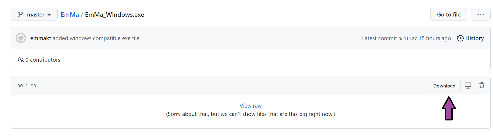

# EmMa
EmMa is a program facilitating kinetics calculations for FTIR data on microplastic degradation. This program was developed
as a part of a bachelor thesis by Emma Kuttainen Thyni and Maja Walfridson at KTH 2022.

EmMa takes data from an FTIR spectrum, converts it to absorbance if needed, and calculates an area under a specified peak in the spectrum.
This is done for a functional group peak and a reference peak, both chosen by the user. The areas are divided to calculate an index. 

Keywords: FTIR, microplastics degradation, carbonyl index, vinyl index

## Calculations
To calculate an index the program uses the specified area under the band for both
peaks and divides their areas to get an index. First a version of binary search has
been implemented to look for the closest possible wavenumber data point to the
received intervals. Then a baseline correction using a linear function is performed.
The baseline correction is only performed on the desired peaks. Finally, the
integration is done using the trapezoidal method and an area for a peak is
calculated. Using the areas of the peak of the functional group and the reference
peak the index is calculated using the formula:

Index=(area of functional peak)/(area of reference peak).

The FWHM (full width at half maximum) of the peaks is calculated after the baseline
of the peaks has been corrected. It is calculated by finding all instances of a
y-value within a peak going from lower than half of the maximum value within that
peak to higher than half of the maximum value of the peak. The corresponding
x-values are also noted. The FWHM is calculated by taking the distance between the
outermost noted x-values.

## Instructions for download
Please download the version suitable for your system. Click on the file. In

## User instructions
EmMa is a program for facilitating kinetics calculations for FTIR spectra. The program
uses data from a .csv file on the format 1,2345e+/-001,1,2345e+/-e001 or 123,45,123,45.
To select a file please press the 'Browse' button and select your file. Then please
select the data types for your specific file (eg. if the data is in transmittance or
absorbance and if it is in percent or arbitrary units). There is a possibility to plot
the given data in the given format or in absorbance by pressing 'Plot spectrum' or
'Convert spectrum to absorbance' and then pressing 'Plot spectrum'.

To calculate an index please select your plastic type or select 'Create own interval'
to create a custom interval to consider. If plastic type is selected, a series of pre-
chosen intervals is available for you to select. The first interval is the band range
for the functional group peak and the second interval is for the reference peak. If
'Create own interval' is selected, you may enter your own intervals for the functional
group peak and reference peak. Please make sure to press 'OK' before continuing. After
selecting your desired peaks press 'Calculate index'. This will prompt a plot of your
data with the peaks marked in the plot. The calculated index with be printed at the
top of the plot. The full width at half maximum (FWHM) for both peaks will also be
printed in the window.

